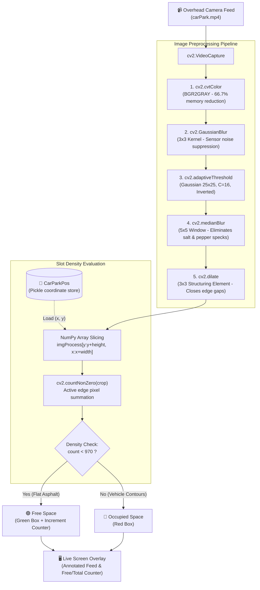

# Real-Time Autonomous Parking Space Detection

An edge-optimized Computer Vision system that monitors parking bay occupancy from static camera footage in real time using adaptive morphological image processing.

---

## Overview

Traditional parking infrastructure relies on embedded ultrasonic or inductive loop sensors, which carry high installation overhead, battery maintenance requirements, and hardware failure rates.

This project delivers an edge-deployable, camera-based vision pipeline that automates parking occupancy tracking. By decoupling static bay calibration from real-time spatial edge-density analysis, the system achieves sub-millisecond per-frame inference on commodity hardware without requiring expensive GPU accelerators.

---

## System Architecture & Processing Pipeline

## System Architecture & Pipeline



### Classification Heuristic
* **Empty Bay:** Flat tarmac exhibits minimal contrast variations under inverted adaptive thresholding ($< 970$ non-zero pixels), registering as **Free** (Green).
* **Occupied Bay:** Vehicle contours, chassis lines, windshield frames, and tires produce dense structural edges ($\ge 970$ non-zero pixels), registering as **Occupied** (Red).

---

## Tech Stack

* **Language:** Python 3.10+
* **Computer Vision:** OpenCV (`cv2`)
* **Numerical Processing:** NumPy
* **Visualization:** `cvzone`
* **State Persistence:** Python Standard Library (`pickle`)

---

## Repository Structure

## Repository Structure

| File / Folder | Role in System |
| :--- | :--- |
| `ParkingSpacePicker.py` | Interactive GUI tool used to mark, adjust, and delete slot bounding boxes via mouse callbacks. |
| `main.py` | Core runtime loop applying the OpenCV transformation pipeline, slot slicing, and live tracking display. |
| `CarParkPos` | Serialized Python binary file storing the list of slot coordinates `(x, y)` using `pickle`. |
| `carParkImg.png` | Baseline static calibration image used by `ParkingSpacePicker.py`. |
| `carPark.mp4` | Video feed used to simulate live surveillance camera footage for real-time testing. |
| `requirements.txt` | Core package dependencies (`opencv-python`, `numpy`, `cvzone`). |
| `.gitignore` | Prevents virtual environments (`.venv`), Python cache files, and OS metadata from leaking into Git. |
| `LICENSE` | Standard open-source MIT License terms. |
| `README.md` | Complete documentation covering architecture, setup, and engineering decisions. |


---

## Getting Started

### 1. Prerequisites
Ensure Python 3.10 or higher is installed. Clone the repository and configure a virtual environment:

```bash
git clone [https://github.com/your-username/parking-space-detection.git](https://github.com/your-username/parking-space-detection.git)
cd parking-space-detection
python -m venv .venv
source .venv/bin/activate  # On Windows: .venv\Scripts\activate
```

### 2. Install Dependencies

```bash
pip install -r requirements.txt
```

Contents of requirements.txt:

* opencv-python>=4.8.0
* numpy>=1.24.0
* cvzone>=1.5.6

### 3. Step 1: Calibrate Parking Slots
Run the coordinate picker to define parking bay bounds:

```bash
python ParkingSpacePicker.py
```
- Left-Click: Draw a new parking slot bounding box.

- Right-Click: Remove an existing bounding box (evaluated via Axis-Aligned Bounding Box intersection).

- Coordinates automatically persist to CarParkPos.

### 4. Step 2: Run Real-Time Detection
Execute the inference pipeline against the video stream:

```bash
python main.py
```
Press q to exit playback.

## Engineering Trade-offs & Production Considerations
- Deterministic vs. Deep Learning: Avoiding heavy convolutional architectures (e.g., YOLO) keeps working memory under 50 MB RAM and execution times under 2 ms per frame on basic CPU hardware.

- Camera Drift Mitigation: Camera pole sway can cause static slot drift. In production, this is remediated by tracking background keypoints (ORB/SIFT) to apply affine homography corrections dynamically.

Transient Occlusion / Shadows: Moving cloud or tree shadows can produce transient edge spikes. Temporal voting (requiring an occupancy state to persist across 30 consecutive frames) eliminates false positives.
